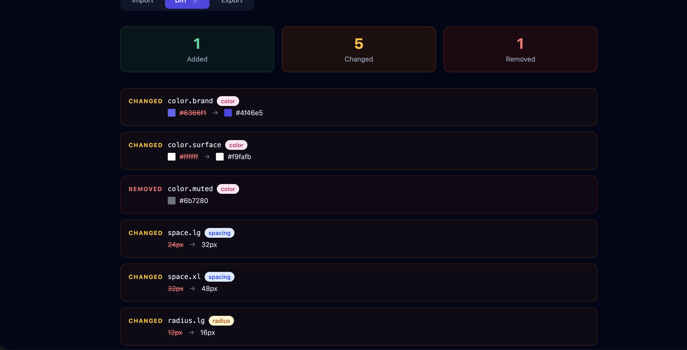

# TokenBridge

> Design token sync, diff & export — bridging Figma variables to production codebases.



## What it does

TokenBridge lets you paste two token sets (e.g. your Figma source and your codebase) and instantly see what's changed, what's been added, and what's been removed — with colour swatch previews and token type classification.

## Features

- **Visual diff engine** — compare two W3C-format token files side by side
- **Colour swatch previews** — see actual colours inline, not just hex strings
- **Token type classification** — automatically detects color, spacing, typography, radius, and shadow tokens
- **Multi-format export** — generate CSS variables, Tailwind config, or a JS object in one click
- **Copy to clipboard** — export and paste directly into your codebase

## Tech stack

- React 19 + TypeScript
- Vite
- Tailwind CSS v3

## Getting started
```bash
git clone https://github.com/manilka005/tokenbridge.git
cd tokenbridge
npm install
npm run dev
```

Open http://localhost:5173

## Usage

1. **Import** — paste your source tokens (Figma) and target tokens (codebase) as JSON
2. **Diff** — click Parse & Compare to see a visual breakdown of all changes
3. **Export** — choose CSS variables, Tailwind config, or JS object and copy

## Token format

TokenBridge accepts W3C Design Token format:
```json
{
  "color": {
    "brand": { "value": "#6366f1" },
    "surface": { "value": "#ffffff" }
  },
  "space": {
    "md": { "value": "16px" }
  }
}
```

## Roadmap

- [ ] Figma API integration — pull tokens directly from a Figma file
- [ ] VS Code extension — sync tokens without leaving your editor
- [ ] Token history — track changes across versions
- [ ] Team collaboration — shared token sets with conflict resolution

## License

MIT